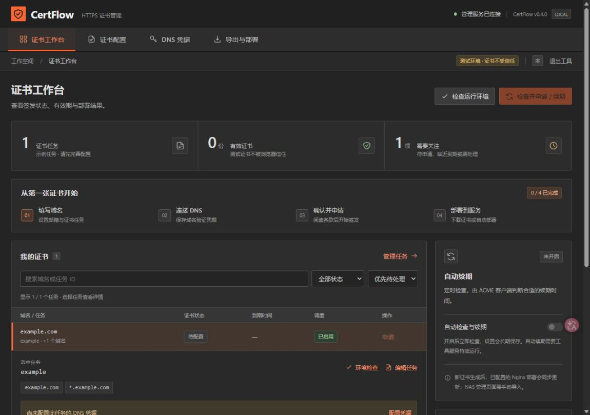

# CertFlow · HTTPS 证书管理

图形化证书管理工具，使用 Node.js 22+ 和 lego v5，通过 Let's Encrypt 申请证书、定期检查续期，并可更新配置的 Nginx 证书目录。支持 Windows 本机使用和 NAS Docker 长期运行，原命令行功能继续保留。

**绿联 DXP4800 长期部署请看 [NAS Docker 部署指南](docs/docker-nas.md)**：包含镜像拉取、Compose、登录密码、数据持久化、备份与升级步骤。镜像由 GitHub Actions 在 Windows / Linux 测试及隔离容器验证通过后发布。具体版本的验收记录见 [0.4.0 发布验收](docs/RELEASE-0.4.0.md)。

**尚未在你的宝塔、Nginx 或绿联 NAS 上安装，也未使用你的真实域名完成签发和部署验证。** 默认使用测试环境；配置完整后才能申请证书。



## 续期后需要更新证书吗？

需要。续期会签发一张新证书，原证书的有效期不会改变。网站必须使用新证书文件，并让 Nginx 等服务重新加载，浏览器才能收到新证书。配置本工具的部署步骤后，可以自动完成“续期 → 更新文件 → 检查配置 → 重载服务”。

如果只是下载了新证书，宝塔、NAS 或云服务仍使用旧文件，网站依然会过期。针对你的绿联 DXP4800，工具会生成管理页面导入所需的 PEM 文件；UGOS 管理页面的自动导入尚未接入，每次续期后仍需手动导入并关联服务。证书有效期以实际签发结果为准，不写死为固定天数。

## 支持范围

- 多个域名任务；普通域名、通配符域名。
- DNS 验证：DNSPod ID / Token、腾讯云 SecretId / SecretKey、阿里云 DNS、Cloudflare。
- HTTP 验证：已有网站的 webroot；不适用于通配符证书。
- 首次申请、周期性续期检查、失败退避与本地状态查询。
- 自动导出证书、中间证书链、完整证书链及私钥，供绿联管理页面等界面导入。
- 生产证书部署到本机目录，执行配置检查及服务重载。
- 加密保存 DNS 凭据、保留最近 100 条活动记录、重启恢复自动续期开关。
- 证书搜索与状态筛选、配置草稿保护、字段校验、任务操作及导出指引。
- 深色工作台、证书表格与详情、单任务暂停、只读运行环境检查和整套 PEM ZIP 下载。

暂停任务会从“全部执行”和自动续期中排除，仍可以明确选择该任务单次执行。运行环境检查不会创建 DNS 记录、签发证书或执行重载命令；它检查客户端、凭据格式、路径权限、条款、遗留锁与损坏状态。远端 DNS 权限和公网可达性仍需实际流程验证。

建议把工具运行在实际使用证书的 Linux 服务器上，例如宝塔所在服务器。Windows 也可以申请证书并保留文件。跨服务器分发、宝塔面板 API 和绿联 NAS API 尚未接入，签发与安装到远程设备是两个步骤。

## 图形界面快速开始

先安装 Node.js 22 或更高版本，并按下方说明准备 lego。Windows 用户双击 **`启动图形界面.cmd`**：启动器会在后台启动本机服务，然后打开浏览器中的 `http://127.0.0.1:3390`。重复双击会打开已有界面，不会重复启动同一端口的服务。

界面可管理域名任务、邮箱、测试/正式环境和部署设置，查看证书状态，执行配置检查、申请/续期，并开启自动续期。DNSPod 密钥在界面中单独填写；保存配置不会替你同意 Let's Encrypt 协议，也不会自动申请证书。首次使用建议保持测试环境，检查配置后再手动申请。

申请/续期任务运行时，界面暂时禁止修改配置与凭据，避免同一轮任务使用不一致的设置；自动续期已开启但当前空闲时，可以直接修改，无需反复开关调度。

**DNS 凭据默认加密长期保存，重启后自动加载。** Windows 使用当前用户 DPAPI；NAS/Linux 使用 AES-256-GCM 和受文件权限保护的本地密钥。凭据、密钥和应用偏好位于配置文件旁的 `.certflow` 目录，不写入配置 JSON，也不回填给浏览器。Linux 上能读取整个目录的人可以解密，备份应包含并保护整个目录。Windows 加密文件不能直接迁移到 Linux，迁移后在 NAS 界面重新保存一次凭据。

也可选择“仅本次会话”；会话值优先于已保存值，已保存值优先于环境变量。删除凭据会同时删除持久值和会话值；进程环境变量若仍存在则继续生效。CLI 的 `run` / `watch` 也会加载同目录的已保存凭据。关闭浏览器不影响服务。Windows 用户需要退出时，双击 **`停止图形界面.cmd`**；若正在签发，服务会等待任务完成。

自动续期只有在服务持续运行、机器在线、凭据可用时才会进行。开关设置会保存，重启工具会自动恢复；停止服务不会清除这个偏好。Docker 使用 `restart: unless-stopped` 持续运行；Windows 本机版未安装开机启动任务，重启电脑后仍需启动工具。不要让 GUI 和命令行 `watch` 同时调度同一配置。

其他系统或希望查看终端日志时，在本工具目录运行：

```sh
npm start
```

然后在本机浏览器访问 `http://127.0.0.1:3390`；终端方式按 Ctrl+C 退出。没有 npm 第三方依赖，无需 `npm install`。默认只监听 `127.0.0.1`。Docker 模式监听网络时必须提供管理密码和明确的访问地址，未登录无法读取证书、配置或凭据状态。修改端口或配置文件可使用：

```sh
npm start -- --port 3391 --config /绝对路径/cert-config.json
npm run cli -- plan
```

Windows 启动器也支持 `powershell.exe -NoProfile -ExecutionPolicy Bypass -File .\launch-gui.ps1 -Port 3391 -Config .\cert-config.json`；对应停止命令增加 `-Stop` 并使用相同端口。相对配置路径以工具目录为基准。后台日志位于 `data/gui-server.stdout.log` 和 `data/gui-server.stderr.log`。若端口被其他程序占用，启动器会提示错误，不会结束其他进程。

图形界面不改变设备支持范围：绿联 DXP4800 管理页面仍需手动导入新证书；Windows 上申请的证书仍需复制或导入到宝塔、NAS 或其他实际使用它的设备。

## 安装与第一次检查

1. 安装 Node.js 22 或更高版本。
2. 从 [lego 官方 v5.5.2 发布页](https://github.com/go-acme/lego/releases/tag/v5.5.2) 下载对应操作系统和架构的程序，按发布页校验和核对下载文件。解压后加入 `PATH`，或在配置的 `legoPath` 填入可执行文件绝对路径。使用 v5.5.2；v4 的命令和数据目录不兼容。参见 [官方安装说明](https://go-acme.github.io/lego/install/)。
3. 在本工具目录运行：

```sh
node cli.mjs init
node cli.mjs plan
```

本工具没有 npm 第三方依赖，不需要运行 `npm install`。`init` 创建 `cert-config.json`，不会覆盖已有文件。`plan` 和 `status` 不申请证书、不修改 DNS，也不重载服务。

示例文件中的域名、邮箱都需要替换。先保留 `environment: "staging"` 与 `deployment: null`，用测试环境验证域名控制权。测试证书不会被浏览器正常信任。

## DNSPod ID / Token 配置

你在 [DNSPod 控制台创建的 Token](https://console.dnspod.cn/account/token/token) 对应 **DNSPod（ID / Token）**，界面内分别填写数字 ID 与 Token，默认长期保存。不要选择腾讯云模式，也不要把 `ID,Token` 整段填入 Token 字段。

`cert-config.json` 示例：

```json
{
  "email": "你的真实邮箱",
  "acceptTerms": false,
  "environment": "staging",
  "legoPath": "lego",
  "dataDir": "./data",
  "jobs": [
    {
      "id": "my-site",
      "domains": ["你的域名", "*.你的域名"],
      "challenge": { "type": "dns", "provider": "dnspod-token" },
      "deployment": null
    }
  ]
}
```

请填入真实域名。`example.com` 与 `*.example.com` 是两个不同的覆盖范围，通配符不包含主域名；不需要通配符时删除第二项。相对文件路径以配置文件所在目录为基准。

阅读 [Let's Encrypt 订阅者协议](https://letsencrypt.org/repository/) 并同意后，将 `acceptTerms` 改为 `true`。这是实际申请的前置条件，工具不会代替你默认同意。

可直接在图形界面保存凭据；也可通过运行进程的环境提供，**不要写入配置 JSON、源码或聊天**。不同模式的名称如下：

| DNS 服务 | `provider` | 环境变量 |
| --- | --- | --- |
| DNSPod ID / Token | `dnspod-token` | `DNSPOD_API_ID`、`DNSPOD_API_TOKEN` |
| 腾讯云 DNSPod | `tencentcloud` | `TENCENTCLOUD_SECRET_ID`、`TENCENTCLOUD_SECRET_KEY` |
| 阿里云 DNS | `alidns` | `ALICLOUD_ACCESS_KEY`、`ALICLOUD_SECRET_KEY` |
| Cloudflare | `cloudflare` | `CF_DNS_API_TOKEN`，令牌需包含目标区域的 Zone Read 和 DNS Edit 权限 |

传统 Token 模式由本工具通过 lego exec 接入 [DNSPod 官方传统 API](https://docs.dnspod.cn/api/api-public-request/)，只为验证创建 TXT 记录，清理时按本次创建返回的记录 ID 核对并删除。lego 负责 CNAME 处理与 DNS 传播检查。为保持旧配置兼容，`dnspod` 仍是 `tencentcloud` 的旧别名；新配置请明确使用 `dnspod-token`。[腾讯云说明](https://go-acme.github.io/lego/dns/tencentcloud/)、[阿里云说明](https://go-acme.github.io/lego/dns/alidns/)与 [Cloudflare 说明](https://go-acme.github.io/lego/dns/cloudflare/)列有各自权限及其他选项。

传统 API 的联系邮箱需为 ASCII 格式。验证记录凭单保存在 `data/<environment>/<任务ID>/dnspod-challenges`。异常退出或远端记录被修改时，工具会保留凭单并提示待清理信息；即使证书签发成功，也应查看任务提示。工具不会按名称盲删其他 TXT 记录。

在 Linux 上可使用受限权限的环境文件配合 systemd 加载；在 Windows 上可从凭据管理方案注入当前 PowerShell 进程。工具不自动加载 `.env`。不要把密钥放入命令行参数，也不要将私钥及 `data` 目录提交到 Git。

然后执行测试签发：

```sh
node cli.mjs run
node cli.mjs status
```

测试成功后将 `environment` 改为 `production`，再次执行 `run` 申请浏览器信任的正式证书。测试与生产使用分离的数据目录。保留账户和证书状态数据，后续续期仍使用它们。

每次成功执行 `run` 后，结果中的 `exportFiles` 给出可以直接导入的文件路径；之后也可用 `status` 查看对应任务的 `state.exportFiles`。使用默认配置时，文件位于 `data/<environment>/<任务ID>/exports/<证书SHA-256>/`。每张证书使用独立目录，包含 `cert.pem`、`chain.pem`、`fullchain.pem` 和 `privkey.pem`。下载和手工导入时，以**最近一次成功的正式环境结果**为准，从同一个导出目录选择文件，避免混用不同签发批次的证书与私钥。

## 绿联 DXP4800 管理页面导入

按[绿联官方证书说明](https://support.ugnas.com/detail/article/zh-CN/107)，进入 **控制面板 → 安全性 → 证书**，新增并选择“导入证书”。将上一步同一份正式证书导出目录中的文件按以下方式选择：

| 管理页面字段 | 本工具导出文件 | `exportFiles` 中的路径字段 |
| --- | --- | --- |
| 私钥 | `privkey.pem` | `privateKey` |
| 证书 | `cert.pem` | `certificate` |
| 中间证书 | `chain.pem` | `chain` |

`fullchain.pem` 已合并证书与中间证书链，供 Nginx 等需要完整链的服务使用；管理页面有独立的中间证书字段时，按上表分别导入。导入后还需打开 **服务配置**，为管理网页等目标服务选择刚导入的证书并保存。随后使用证书覆盖的域名访问管理页面，核对浏览器显示的证书有效期。直接通过局域网 IP 访问时，域名证书通常不会匹配该 IP。

绿联官方说明支持 X.509 PEM 证书及无密码短语保护的 ECC/RSA 私钥；本工具导出 PEM 格式文件。以上流程依据官方文档编写，尚未在你的 DXP4800 上实测，界面名称以当前 UGOS 版本为准。工具不会改写 UGOS 内部证书文件；目前自动申请、续期和导出已实现，管理页面的导入与服务关联仍需手动完成。

## 宝塔 / Nginx 自动安装证书

先在宝塔对应站点中确认实际使用的证书文件路径，并备份现有证书和 Nginx 配置。关闭与本工具管理同一份证书的宝塔续期任务，避免两个工具互相覆盖。

正式环境下，把相应任务的 `deployment` 改为以下形式；路径和命令必须按实际服务器配置调整：

```json
"deployment": {
  "directory": "/www/server/panel/vhost/cert/你的站点目录",
  "checkCommand": ["/www/server/nginx/sbin/nginx", "-t"],
  "reloadCommand": ["/www/server/nginx/sbin/nginx", "-s", "reload"]
}
```

上面是常见宝塔路径示例，不保证与每台服务器一致。普通 Nginx 可使用 `"directory": "/etc/nginx/ssl/你的站点"`，并把命令改为该机器 Nginx 程序的实际路径。

部署目录中的文件名固定为 `fullchain.pem` 和 `privkey.pem`。Nginx 的 `ssl_certificate` 和 `ssl_certificate_key` 需分别指向它们。两个命令都必须提供；工具先写入证书文件，再检查配置，检查成功才重载。`checkCommand`、`reloadCommand` 是程序加参数数组，不经过 shell；不支持直接使用 `&&`、管道和 `$变量` 展开。如需脚本，提供脚本解释器及脚本路径。子进程可读取 `CERT_FULLCHAIN` 和 `CERT_PRIVATE_KEY` 环境变量。

部署会保留恢复信息并在失败时尝试回滚文件。更新两份文件使用逐文件替换，**并非证书和私钥的同时原子切换**；更新期间应仅由本工具控制重载，避免其他进程在两份文件之间触发重载。异常断电后应再次运行 `run` 完成恢复，并检查网站实际呈现的证书。`status` 展示本地状态，不等于已从公网验证线上证书。

只有 `environment: "production"` 才允许部署；测试阶段请保持 `deployment: null`。运行账户必须有目标目录写权限及配置检查、重载权限。多台服务器或绿联 NAS 需要各自完成安装步骤；当前版本不自动远程上传。

## 后续 Docker 中的 Nginx 服务

如果之后在 DXP4800 的 Docker 中运行 Nginx，可让本工具运行在同一台 Docker 宿主机上，向固定的 `deployment.directory` 部署文件，再通过 `docker exec` 检查并重载容器。这里是待配置的示例，尚未启动容器或在 NAS 实测；它只更新该容器使用的证书，不会自动替换 UGOS 管理页面的证书。

```json
"deployment": {
  "directory": "/srv/https-certs/my-site",
  "checkCommand": ["docker", "exec", "web-nginx", "nginx", "-t"],
  "reloadCommand": ["docker", "exec", "web-nginx", "nginx", "-s", "reload"]
}
```

`/srv/https-certs/my-site`、`web-nginx` 都是示例，需要替换为实际 NAS 目录和容器名。完整配置参考 `examples/nginx-docker-config.json`，其中仍保留示例域名、邮箱和未接受条款状态。

在该容器配置中，将宿主机的**整个部署目录**只读绑定到容器目录；Docker `--mount` 参数片段如下：

```text
--mount type=bind,src=/srv/https-certs/my-site,dst=/etc/nginx/certs,readonly
```

绑定整个目录可让容器在工具替换目录内文件后读取更新后的文件，避免单个证书文件绑定后仍指向旧文件。`src` 必须位于 Docker daemon 所在的宿主机上，并在创建挂载前存在；`readonly` 限制容器写入，不影响宿主机上的工具更新文件。参见 [Docker 绑定挂载文档](https://docs.docker.com/engine/storage/bind-mounts/)。容器中的 Nginx 配置使用：

```nginx
ssl_certificate     /etc/nginx/certs/fullchain.pem;
ssl_certificate_key /etc/nginx/certs/privkey.pem;
```

首次配置时，先保持 `deployment: null` 完成正式签发；将同一导出目录的 `fullchain.pem` 与 `privkey.pem` 放入固定部署目录，再配置并启动能读取这两份文件的容器。确认容器正常运行后，再启用上述部署配置。后续 `run` 会更新固定目录中的文件，检查成功才重载。运行工具的账户需有 Docker 执行权限，容器内 Nginx 需有证书读取权限；请结合容器用户和宿主机目录权限配置。[`docker exec` 仅能在运行中的容器内执行命令](https://docs.docker.com/reference/cli/docker/container/exec/)，因此容器停止时部署会失败并进入重试。

## 自动续期调度

```sh
node cli.mjs watch --config /绝对路径/cert-config.json
```

启动后立即执行一轮，正常情况下每 12 小时加最多 30 分钟随机延时检查一次。失败任务按最近的退避到期时间提前重试，并加入最多 30 秒随机延时；配置、运行锁等整轮异常约 5 分钟后重试。是否续期由证书状态及 ACME 客户端判断，检查不代表每次都重新签发。每轮读取配置；一轮失败会输出错误并保留后续调度。按 Ctrl+C 或发送 SIGTERM 时停止后续调度，等待当前一轮结束。

**自动续期要求机器在线且任务持续运行。** 关闭终端、关机或未启动服务都可能中断续期。可选择以下一种方式，不要同时重复调度同一配置：

- Linux：让 systemd 维护 `watch` 进程，配置绝对 `ExecStart`、工作目录、专用运行账户、受限权限的 `EnvironmentFile` 和失败重启；查看 journal 日志。按目标机实际路径和权限创建服务后，再启用开机启动。
- Windows：用任务计划程序每 12 小时执行一次 `node.exe /工具路径/cli.mjs run --config /配置路径/cert-config.json`，设置工作目录、任务账户、环境变量，并选择已有实例运行时不启动新实例。

Windows 本机版不会自动创建系统服务或计划任务；NAS 推荐使用附带 Docker Compose 持续运行服务。界面保留最近 100 条运行日志及每个任务的最后错误和重试时间，尚未接入邮件或微信通知。

若进程异常退出，可能留下 `.run.lock` 或 `.cert-deploy.lock`，工具会阻止再次运行。只有确认相关 Node、lego 及部署子进程全部结束后，才能移除错误信息指明的遗留锁，再执行 `run` 恢复。正常任务失败无需手动删锁；不要在其他任务仍运行时删除锁文件。

## 命令速查

```sh
node cli.mjs --help
node cli.mjs init --config cert-config.json
node cli.mjs plan --config cert-config.json
node cli.mjs status --config cert-config.json
node cli.mjs run --config cert-config.json
node cli.mjs run --only my-site
node cli.mjs run --only my-site --retry
node cli.mjs watch --config cert-config.json
```

`--retry` 只忽略失败退避，不强制签发，不应频繁使用它绕过错误重试间隔。一次性 `run` 有任务失败时返回非零退出码。

HTTP 验证可把 `challenge` 改为 `{"type":"http","webroot":"/var/www/html"}`。已有站点必须让证书机构通过公网 80 端口访问该目录下的 `/.well-known/acme-challenge/` 文件；配置防火墙、反向代理和域名解析后再使用。通配符必须使用 DNS 验证。参见 [Let's Encrypt 验证方式](https://letsencrypt.org/docs/challenge-types/)。

本地测试命令：`npm test`。自动化测试使用模拟客户端；通过测试不代表真实 DNS、证书机构、Nginx 或 NAS 的集成已经验证。

## 私钥或任务状态损坏时

界面会区分未签发、证书不可读、私钥缺失、不匹配、已过期等状态，不会仅按日期把无效证书标记为可用。一个任务的状态损坏不会阻塞其他任务，原文件会保留供恢复。

有匹配备份时，先停止服务并保留当前目录，再恢复该任务的整套证书、私钥和状态。没有匹配私钥时，可以暂停旧任务，使用新的任务 ID 申请替代证书，保留旧数据；若配置过自动部署，先解除旧任务的部署绑定，避免两个任务指向同一目标。不要删除私钥后反复点击检查，普通续期判断不保证强制重发。

## 开发与发布

运行环境无 npm 第三方依赖。测试要求 Node.js 22；ZIP 兼容性检查在 Windows 使用 .NET，在 Linux 使用 Python 标准库。`node scripts/setup-test-lego.mjs` 安装经 SHA-256 校验的固定版测试客户端，GitHub CI 会执行该步骤并要求真实客户端桥接测试通过。

推送 `main` 会运行 Windows / Linux 测试、构建 Linux amd64 镜像，并在禁用外部网络的真实容器中验证权限、登录和持久化。推送与 `package.json` 版本一致的 `v*` 标签，或在 `main` 手动选择发布，才会在验证成功后推送 GHCR 镜像。默认部署使用固定版本，升级请先备份并阅读验收记录。
